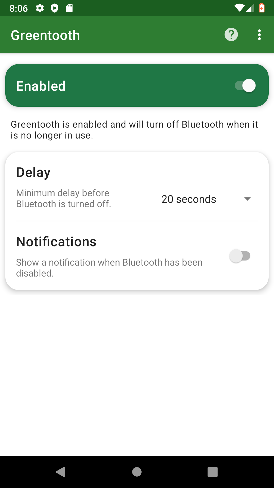
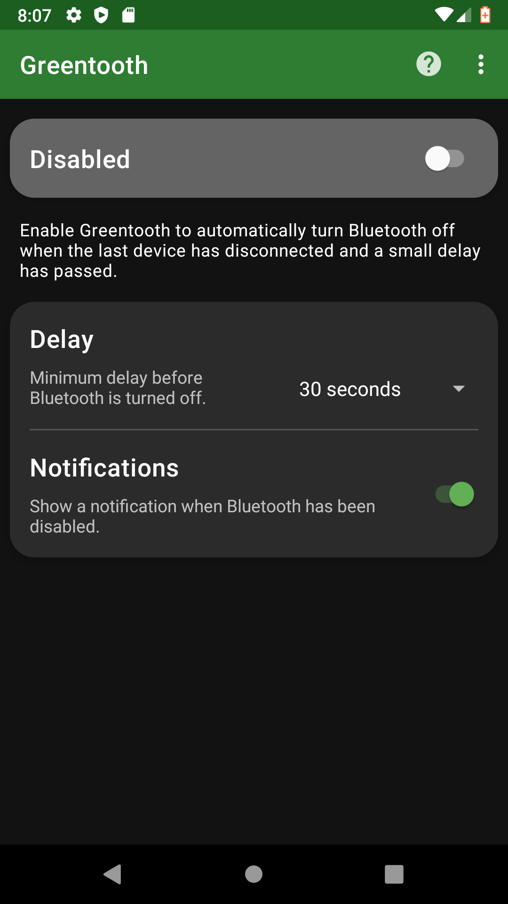

#  Greentooth

This app disables Bluetooth automatically when the last Bluetooth device has
been disconnected.

  

Bluetooth can cause unnecessary battery drain and is a potential security risk if
it is always turned on. Security experts recommend [switching Bluetooth off](https://www.webroot.com/us/en/resources/tips-articles/a-review-of-bluetooth-attacks-and-how-to-secure-mobile-workforce-devices) 
 [when you're not using it](https://www.wired.com/story/turn-off-bluetooth-security/).
 However, manually disabling Bluetooth when you're done listening to music or
 talking in your headset is annoying and easy to forget.

Greentooth can help you save battery and mitigate the security risks of Bluetooth
by automatically turning Bluetooth off when it is no longer needed. When the
last Bluetooth device has disconnected Greentooth will wait for an adjustable
amount of time in order to not disturb any connection/reconnection attempts and
then deactivate Bluetooth.

Please note that Greentooth only runs upon device disconnection, it does not do
periodical checks for idle Bluetooth.  
  

  
  

